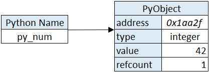
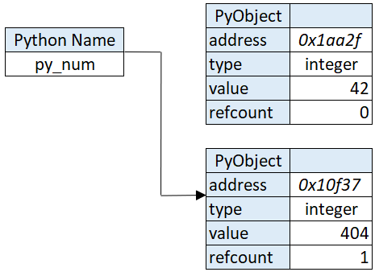

# Why Python is so slow and how to speed it up

Reference: [Why Python is so slow and how to speed it up](https://towardsdatascience.com/why-is-python-so-slow-and-how-to-speed-it-up-485b5a84154e)

## Python design

### Dynamically typed vs Statically typed

Python is dynamically typed. In languages like C, Java or C++ all variable are statically typed, this means that you write down the specific type of a variable like int my_var = 1;.

In Python we can just type my_var = 1. We can then even assign a new value that is of a totally different type like my_var = “a string". We’ll see how this works under the hood in the next chapter.

### Compiled vs Interpreted

C: compile from source code to machine code

Python works a little different:

1. Source code is not compiled into machine code but into platform-independent bytecode. Like machine code, bytecode are also instructions but in stead of being executed by the CPU they are executed by an interpreter.
2. Source code gets compiled while running. Python compiles files as needed in stead of compiling everything before running the program.
3. The interpreter analyzes the bytecode and translates it to machine code.


### Garbage collection and memory management
When you create a variable in Python, the interpreter automatically picks out a spot in memory that is large enough for the value of the variable and stores it there. Then, when the variable is not needed anymore, the slot of memory gets freed again so that other processes can use it again.

In C, the language where Python is written in, this process is not automated at all. When you declare a variable you need to specify its type so that the correct amount of memory can be allocated. Also garbage collection is manual.

**reference count**

So how does Python keep track of which variable to garbage-collect? For each object Python keeps track of how many objects reference that object.If a variable’s reference count is 0 then we can conclude that the variable isn’t used and that it can be deallocated in memory.

### Single-thread vs multi-threaded
[GIL](GIL.md)

## python design in practice

### Declaring a variable in C: overwrite
``` c
int c_num = 42;
```
1. Allocate enough memory for an integer at a certain address (location in memory)
2. Assign the value 42 to the location of the memory that’s allocated in the previous step
3. Point c_num to that value

If we want to assign a new number to c_num, we need to write the new number to the same address; overwriting, the previous value. 

### Declaring a variable in Python: point ot another object
``` python
py_num = 42
```

1. Create a PyObject; allocating enough memory to an address
2. Set the PyObject’s typecode to integer (as determined by the interpreter)
3. Set the PyObject’s value to 42
4. Create a name called py_num
5. Point py_numto the Pyobject
6. Increment the PyObject’s refcount by 1

<center>

</center>

This is what is meant by the phrase ‘everything in Python is an object’. Python might have the int, str and float types but under the hood every Python variable is just a PyObject. This is why dynamic typing is possible.

So what happens when we want to assign a different value to py_num?

1. Create a new PyObject at a certain address, allocating enough memory
2. Set the PyObject’s typecode to integer
3. Set the PyObject’s value to 404 (the new value)
4. Point py_numto the Pyobject
5. Increment the new PyObject’s refcount by 1
6. Decrease the old PyObject’s refcount by 1

<center>

</center>

## How to speed things up

1. Use built-in C-modules in Python like `range()`
2. I/O-tasks release the GIL so they can be threaded; you can wait for many tasks to finish simultaneously
3. Run CPU-tasks in parallel by multiprocessing.
4. Create and import your own C-module into Python; you extend Python with pieces of compiled C-code that are 100x faster than Python.